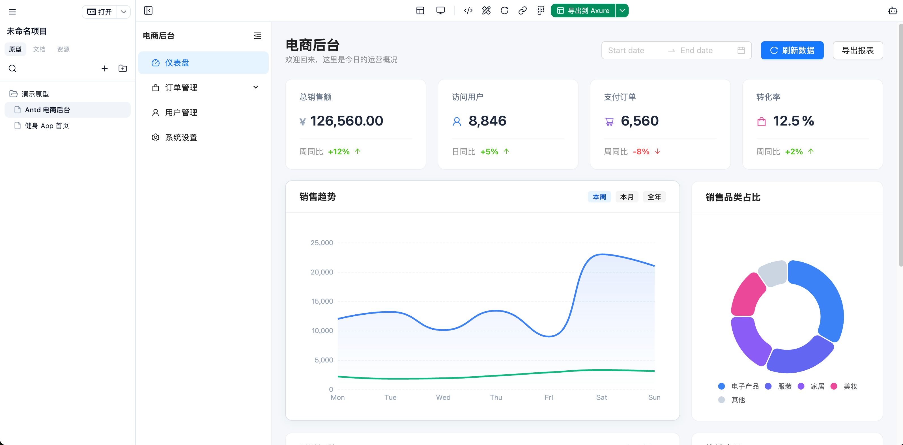

> [!NOTE]
> Axhub Make 不是“又一个 AI 生成原型工具”。它是一条从 **需求** 到 **文档** 到 **原型** 再到 **交付（Axure / Figma / Html）** 的工作流。

<div align="center">
  
</div>

# 跳过这个 README 吧

读文档的时代已经过去了。直接把下面这行发给你的 Agent：

```
阅读这个 README，并告诉我它为什么不只是又一个 AI 生成原型工具：
https://raw.githubusercontent.com/lintendo/Axhub-Make/refs/heads/main/README.md
```

# Axhub Make

一个给 **产品**、**设计师** 和 **AI Agent** 用的原型与文档协作工作流。

你说清楚要什么，Make 会把它变成：
- 可以跑的交互原型（不是截图，不是 PPT）
- 完整的多类型文档（需求文档、用户故事、规格文档等）
- 可持续复用的资源资产（主题、组件、数据表等）
- 可导出的交付物（Axure / Figma / Html）

---

## 安装

统一交给 AI Agent 安装。把下面这段直接发给你的 Agent（Claude Code、TRAE、Cursor 等）：

```
请根据这里的说明安装并配置 Axhub Make：
https://raw.githubusercontent.com/lintendo/Axhub-Make/refs/heads/main/rules/installation.md
```

如果 Agent 需要命令行入口，让它执行：

```bash
curl -s https://raw.githubusercontent.com/lintendo/Axhub-Make/refs/heads/main/rules/installation.md
```
---

## 核心亮点

Axhub Make 把「需求讨论」变成「可执行工作流」，核心能力如下：

- 可视化管理原型和文档，不懂开发的产品和设计师也能直接使用
- 内置 30+ 专业的原型生成与文档协作技能（`skills`）
- 内置项目与资源管理和生成能力，让 AI 持续产出视觉风格一致、逻辑统一的原型和文档
- 内置 `spec` 驱动的原型生成机制，减少 AI 生成过程中的幻觉和偏题
- 支持从 Axure、V0、Stitch、AIStudio 以及任意网页导入原型或资源
- 支持导出到 Axure 或 Figma，完美融入原有工作流

### 三大产物

| 产物 | 你会在仓库里看到什么 | 为什么重要 |
| :-- | :-- | :-- |
| 原型 | `src/prototypes/` | 用于评审真实交互和业务流程，不再只看静态稿 |
| 文档 | `src/docs/` | 按专门文档编写流程沉淀信息，支撑协作、评审与复盘 |
| 资源 | `src/themes/`、`src/components/`、`assets/database/` | 统一管理主题、组件、数据表，保证持续生成的一致性 |

---

## 给 Agent 的入职材料

你可以把下面这段直接贴给 Agent，当作“入职说明”：

```
你正在 Axhub Make 仓库中工作。

请阅读并遵循：
- AGENTS.md（工作流与原则）

你必须：
- 以产品经理 + UI/UX 设计师 + 前端工程师的复合角色开展工作
- 遵循项目的文档编写流程，并维护必要文档
- 持续实现并维护可运行的原型、文档和可复用资源
```
