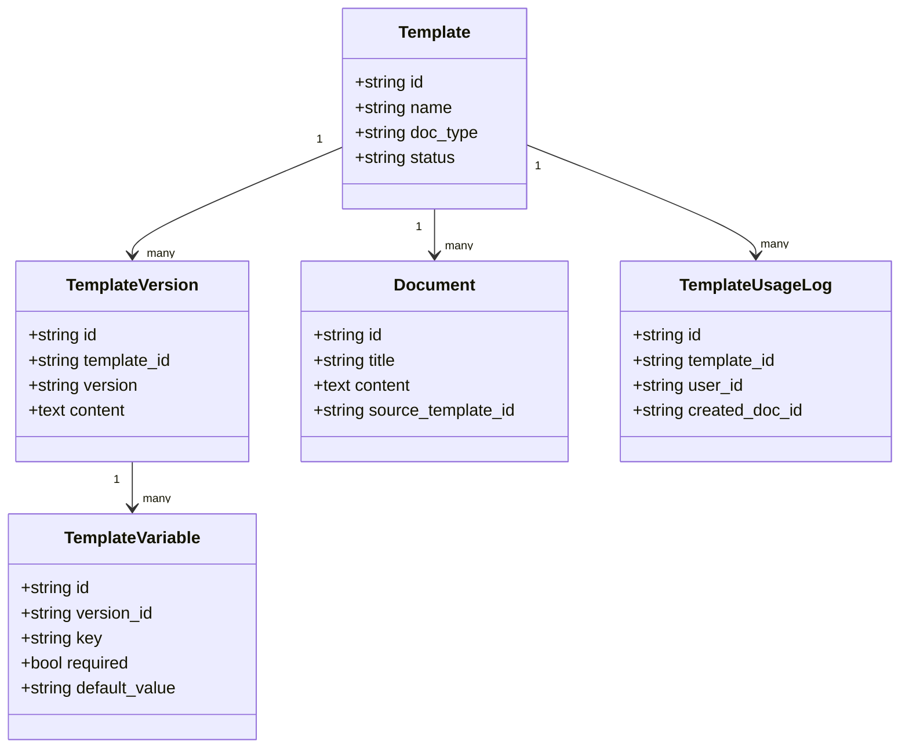
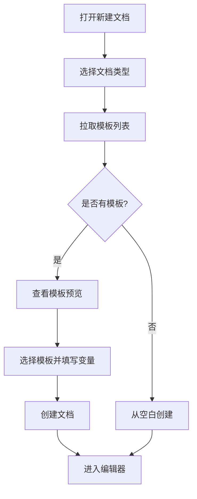
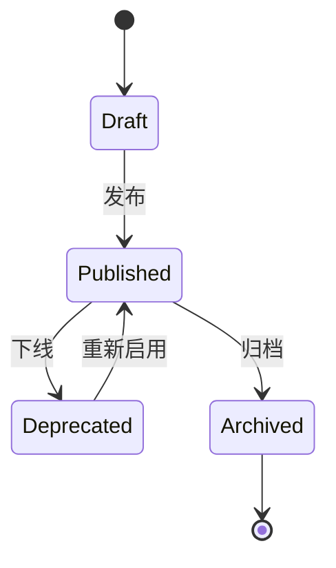

# RPD 示例（用户故事主导）：新建文档模板功能

> 说明：这里使用 `RPD` 命名（Requirements/Product Document）。如果团队习惯 `PRD`，可直接替换标题，不影响结构。

## 0. 文档信息

- 版本：`v1.0`
- 状态：`Draft`
- 目标上线：`2026-03-31`
- 负责人：`产品经理 / 模板能力小组`
- 关联范围：`新建文档弹窗`、`模板选择`、`模板变量替换`、`文档初始化`

---

## 1. 背景与目标

### 1.1 背景问题

当前“新建文档”流程存在以下问题：

1. 只能从空白开始，产出质量依赖个人经验。
2. 不同文档（PRD、用户故事、研究报告）结构不统一，协作成本高。
3. 新成员不清楚文档标准，反复返工。

### 1.2 业务目标

1. 将“新建文档到首版可评审”的平均时长缩短 `40%`。
2. 模板创建文档占比提升到 `>= 70%`。
3. 核心文档字段完整率（必填章节）达到 `>= 90%`。

### 1.3 非目标

1. 本期不做模板在线协同编辑（多人同时编辑模板）。
2. 本期不做跨项目模板市场（仅项目内模板库）。
3. 本期不做智能自动写全篇（仅模板结构和变量预填）。

---

## 2. 用户角色

| 角色 | 核心诉求 | 使用频率 |
| --- | --- | --- |
| 产品经理（PM） | 快速产出高质量需求文档 | 高 |
| 交互设计师（UX） | 基于统一结构补充交互说明 | 中 |
| 技术负责人（TL） | 快速定位需求边界和验收标准 | 中 |
| 观察者（Viewer） | 查看文档，不可编辑模板 | 中 |

---

## 3. 用户故事（核心）

### US-01 按文档类型筛选模板

**As a** 产品经理  
**I want to** 在新建文档时按“文档类型”筛选模板  
**So that** 我能快速找到合适模板并开始填写

**验收标准**

1. Given 用户打开新建文档弹窗  
   When 选择 `文档类型=RPD`  
   Then 模板列表仅展示 `RPD` 相关模板。

2. Given 当前类型下没有模板  
   When 用户查看模板区  
   Then 展示“暂无模板”空状态，并保留“从空白创建”入口。

---

### US-02 预览模板结构

**As a** 产品经理  
**I want to** 在选中模板前预览章节结构和说明  
**So that** 我能判断模板是否符合当前需求

**验收标准**

1. Given 用户点击某模板卡片  
   When 打开预览  
   Then 可看到章节目录、示例段落、更新时间。

2. Given 预览打开  
   When 用户切换模板  
   Then 预览内容在 `500ms` 内更新完成。

---

### US-03 基于模板创建文档并替换变量

**As a** 产品经理  
**I want to** 选择模板后自动替换基础变量（项目名、负责人、日期）  
**So that** 我无需重复手工填写固定信息

**验收标准**

1. Given 用户选择模板并点击“创建”  
   When 系统生成文档  
   Then 模板中的 `{{project_name}}`、`{{owner}}`、`{{date}}` 被替换为当前上下文值。

2. Given 模板包含未提供值的变量  
   When 生成文档  
   Then 该变量保留占位并高亮提示待补充。

---

### US-04 模板推荐（可选增强）

**As a** 产品经理  
**I want to** 看到“最近常用模板”和“同类型热门模板”  
**So that** 我可以更快做选择

**验收标准**

1. Given 用户打开新建文档弹窗  
   When 有历史记录  
   Then 列表顶部展示最近使用模板（最多 `3` 个）。

2. Given 没有历史记录  
   When 查看模板区  
   Then 默认按“团队推荐”排序展示。

---

## 4. MVP 范围（Story Mapping）

| 优先级 | 用户活动 | 故事 | 本期是否纳入 |
| --- | --- | --- | --- |
| Must | 选择模板 | US-01 按类型筛选 | 是 |
| Must | 评估模板 | US-02 预览模板结构 | 是 |
| Must | 生成文档 | US-03 变量替换创建 | 是 |
| Should | 快速选择 | US-04 模板推荐 | 否（下期） |

---

## 5. 对应模型

### 5.1 Domain Model（业务领域模型）

| 实体 | 关键字段 | 说明 |
| --- | --- | --- |
| Template | id, name, doc_type, status | 模板主实体 |
| TemplateVersion | version, content, published_at | 模板版本 |
| TemplateVariable | key, required, default_value | 模板变量定义 |
| Document | id, title, content, source_template_id | 生成后的文档 |
| User | id, role, display_name | 使用者 |
| TemplateUsageLog | template_id, user_id, created_doc_id, created_at | 使用记录 |

### 5.2 Business Flow / Process（业务流程模型）

### 5.3 State Machine / Lifecycle（状态与生命周期模型）

### 5.4 Permission / Access Model（权限模型）

| 操作 | PM | UX | TL | Viewer |
| --- | --- | --- | --- | --- |
| 查看模板列表 | Y | Y | Y | Y |
| 预览模板 | Y | Y | Y | Y |
| 使用模板创建文档 | Y | Y | Y | N |
| 新增/编辑模板 | Y | N | N | N |
| 发布/下线模板 | Y | N | N | N |

### 5.5 Page Structure Model（页面结构模型）

| 页面/区域 | 子模块 | 说明 |
| --- | --- | --- |
| 新建文档弹窗 | 文档类型选择器 | 切换模板集合 |
| 新建文档弹窗 | 模板列表区 | 卡片展示模板 |
| 新建文档弹窗 | 模板预览区 | 展示目录和示例 |
| 新建文档弹窗 | 变量输入区 | 创建前补齐变量 |
| 新建文档弹窗 | 操作区 | 取消 / 从空白创建 / 创建 |

### 5.6 Field Usage / Visibility Model（字段可见性模型）

| 字段 | PM | UX | TL | Viewer | 规则 |
| --- | --- | --- | --- | --- | --- |
| 模板名称 | 可见 | 可见 | 可见 | 可见 | 必显 |
| 模板类型 | 可见 | 可见 | 可见 | 可见 | 必显 |
| 模板变量输入 | 可编辑 | 可编辑 | 可编辑 | 不可见 | 仅创建者可操作 |
| 发布状态 | 可见可改 | 可见 | 可见 | 可见 | 仅 PM 可修改 |

### 5.7 Prototype Variant / Context Model（原型变体模型）

| 变体 | 适用场景 | 差异点 |
| --- | --- | --- |
| 简版（Quick） | 快速记录 | 仅模板列表 + 创建按钮 |
| 标准版（Default） | 日常创建 | 列表 + 预览 + 变量替换 |
| 高级版（Advanced） | 模板治理 | 增加版本说明、推荐排序、状态筛选 |

---

## 6. 非功能需求

1. 性能：模板列表接口 P95 响应时间 `< 300ms`。
2. 可用性：从打开弹窗到进入编辑器，核心路径不超过 `3` 步。
3. 可观测性：记录模板使用率、创建成功率、空白创建比例。
4. 安全性：模板内容按项目空间隔离，禁止跨项目读取。

---

## 7. 验收清单（Definition of Done）

- [ ] US-01 ~ US-03 对应验收标准全部通过。
- [ ] 模板变量替换逻辑覆盖正常、缺失、非法三类输入。
- [ ] 新建文档流程埋点完整（曝光、点击、创建成功/失败）。
- [ ] 用户手册新增“如何使用模板创建文档”章节。

---

## 8. 使用说明（给模板作者）

1. 复制本文件，按实际业务替换“背景、用户故事、模型、指标”。
2. 每条用户故事必须带 `Given / When / Then` 验收标准。
3. 至少保留以下模型：`Domain`、`Flow`、`State`、`Permission`。
4. 若为复杂业务，追加 `事件模型` 与 `数据血缘模型`。
