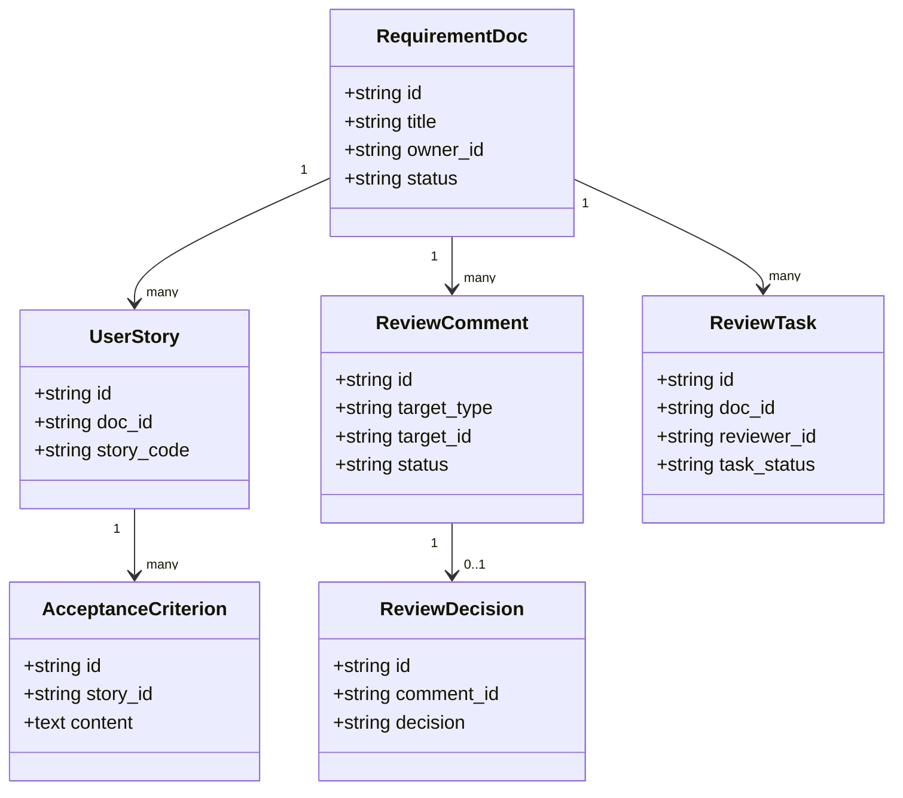
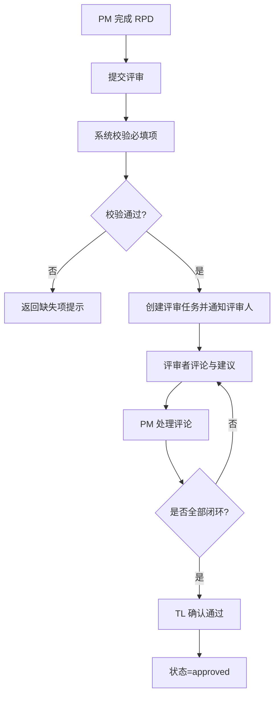
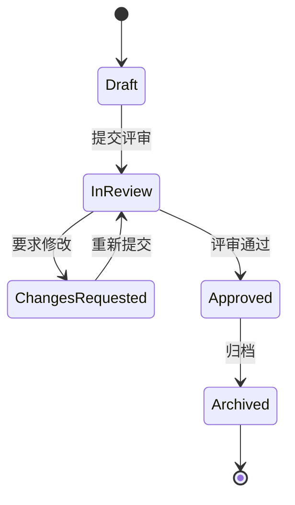

# 需求评审工作台需求文档示例（用户故事驱动）

## 0. 文档信息

- 文档类型：`RPD（Requirements/Product Document）`
- 版本：`v1.0`
- 状态：`Ready for Review`
- 创建日期：`2026-02-25`
- 负责人：`产品平台组`
- 关联范围：`新建文档`、`评审流转`、`评论协作`、`状态跟踪`

---

## 1. 背景与目标

### 1.1 背景问题

当前需求评审流程主要靠 IM + 零散文档同步，导致：

1. 评审意见分散，无法形成可追踪闭环。
2. 用户故事与验收标准经常在评审中丢失或被弱化。
3. 需求状态（待评审/评审中/已通过）缺乏统一视图。

### 1.2 业务目标

1. 需求从“提交评审”到“评审完成”的周期缩短 `30%`。
2. 含完整用户故事与验收标准的需求占比提升到 `>= 85%`。
3. 评审意见闭环率（有结论且状态更新）达到 `>= 90%`。

### 1.3 非目标

1. 本期不实现跨项目评审。
2. 本期不做自动生成 UI 原型，仅支持文档评审。
3. 本期不接入外部审批系统（如 OA/流程引擎）。

---

## 2. 用户角色

---

## 3. 用户故事（核心）

### US-01 提交需求进入评审

**As a** PM  
**I want to** 将 RPD 文档提交到评审工作台  
**So that** 相关角色可以在统一入口完成评审

**Acceptance Criteria**

1. Given PM 在文档页点击“提交评审”
  When 必填字段（背景、用户故事、验收标准）完整  
   Then 文档状态变为 `in_review`，并通知已选评审人。
2. Given 文档缺少必填字段
  When PM 提交评审  
   Then 阻止提交并高亮缺失项。

---

### US-02 按用户故事维度评论

**As a** 评审者  
**I want to** 在指定用户故事或验收标准上评论  
**So that** 反馈与需求上下文强绑定，避免歧义

**Acceptance Criteria**

1. Given 评审者打开文档
  When 选中某条用户故事或某条 AC  
   Then 可发布结构化评论（问题类型、建议、优先级）。
2. Given 评论发布成功
  When PM 查看评论列表  
   Then 可看到“对应故事编号”和“处理状态”。

---

### US-03 评审意见闭环

**As a** PM  
**I want to** 对每条评论标记“接受/拒绝/延后”并补充说明  
**So that** 评审过程可追踪、可复盘

**Acceptance Criteria**

1. Given 有未处理评论
  When PM 逐条处理  
   Then 每条评论都有最终处理结论与处理人。
2. Given 所有评论已处理
  When TL 点击“评审通过”  
   Then 文档状态变为 `approved` 并记录通过时间。

---

### US-04 评审看板追踪

**As a** 项目经理  
**I want to** 在看板中按状态和负责人筛选需求  
**So that** 我能快速识别阻塞项并推动协作

**Acceptance Criteria**

1. Given 进入评审看板
  When 按状态筛选 `in_review`  
   Then 仅展示评审中需求。
2. Given 某需求超过 SLA（48h）未完成
  When 看板刷新  
   Then 显示超时标记并置顶提醒。

---

## 4. MVP 范围（Story Mapping）

---

## 5. 对应模型

### 5.1 Domain Model（业务领域模型）

### 5.2 Business Flow / Process（业务流程模型）

### 5.3 State Machine / Lifecycle（状态与生命周期模型）

### 5.4 Permission / Access Model（权限模型）

### 5.5 Page Structure Model（页面结构模型）

### 5.6 Field Usage / Visibility Model（字段可见性模型）

### 5.7 Prototype Variant / Context Model（原型变体模型）

---

## 6. 非功能需求

1. 性能：文档页评论面板打开时间 P95 `< 400ms`。
2. 一致性：评论状态更新后 `<= 2s` 在看板同步可见。
3. 安全性：仅文档成员可见评论详情，支持操作审计日志。
4. 可用性：核心评审流程（提交 -> 评论 -> 闭环）不超过 `4` 个主要操作。

---

## 7. 验收清单（Definition of Done）

- [ ] 4 条用户故事均有可执行的 Given/When/Then 验收标准。
- [ ] 状态机从 `draft` 到 `approved` 流转完整可回放。
- [ ] 评论闭环数据可导出（含处理结论和处理人）。
- [ ] 关键埋点可用：提交评审、评论创建、评论闭环、评审通过。

---

## 8. 发布计划

### 8.1 v1.0（本期）

- 支持 RPD 提交评审、按故事评论、评论闭环、评审通过。

### 8.2 v1.1（下期）

- 增加评审看板和 SLA 超时提醒（US-04）。

### 8.3 v2.0（后续）

- 增加跨项目评审视图与组织级质量报表。

&nbsp;